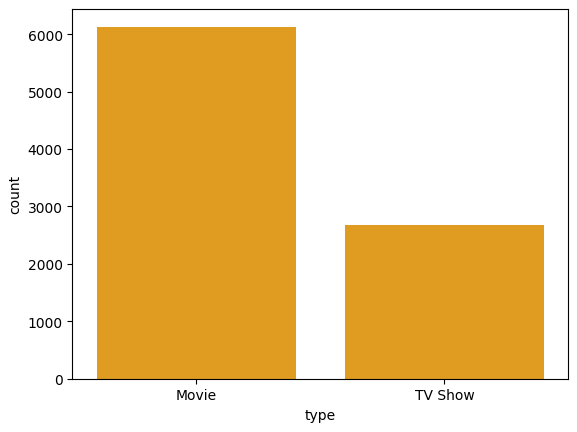
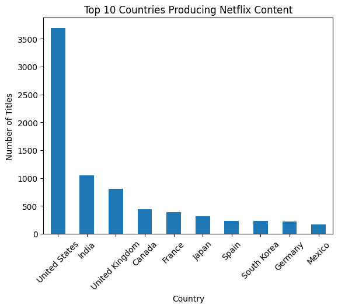
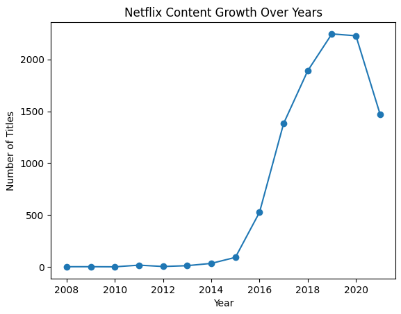

# 📊 Netflix Data Analysis

## 📌 Project Overview

This project performs **Exploratory Data Analysis (EDA)** on the Netflix Movies and TV Shows dataset to uncover patterns in content distribution, geographical production, and platform growth.

The analysis focuses on transforming raw data into **actionable business insights**, helping understand how Netflix scaled globally and what drives its content strategy.

---

## 🎯 Objectives

* Analyze distribution of **Movies vs TV Shows**
* Identify **top countries** contributing to Netflix content
* Examine **content growth trends over time**
* Perform **data cleaning and preprocessing** on real-world data
* Generate **business-focused insights** from data

---

## 🛠️ Tools & Technologies

* Python 🐍
* Pandas
* Matplotlib
* Seaborn
* Jupyter Notebook / Google Colab

---

## 📂 Dataset

* Netflix Movies and TV Shows Dataset (CSV)
* Key features include:

  * Title
  * Type (Movie/TV Show)
  * Country
  * Release Year
  * Date Added
  * Genre

---

## 🔧 Data Cleaning & Feature Engineering

* Handled missing values using appropriate strategies
* Converted `date_added` into datetime format for time-based analysis
* Split multi-country entries into individual rows for accurate aggregation
* Created new features such as:

  * `year_added` for trend analysis
  * Cleaned categorical values for consistency

---

## 📊 Key Visualizations

### 🎬 Movies vs TV Shows

### 🌍 Top Countries Producing Content

### 📈 Content Growth Over Years

---

## 🔍 Key Insights (Business Perspective)

* Netflix has a **movie-heavy content strategy**, with movies significantly outnumbering TV shows
* The **United States dominates content production**, indicating centralized content creation
* **India and the UK are key emerging contributors**, highlighting Netflix’s expansion into global markets
* Content growth increased rapidly after **2015**, reflecting Netflix’s aggressive scaling phase
* Peak growth during **2017–2019** suggests heavy investment in content acquisition and production
* Content distribution is concentrated in a few countries, indicating **regional dominance in media production**

---

## 🚀 Conclusion

Netflix operates as a **globally expanding, movie-dominant platform** with strong reliance on US-based production while increasingly investing in international markets.

The rapid rise in content after 2015 reflects a strategic push toward **global scalability and user acquisition through content diversity**.

---

## 💡 Future Improvements

* Perform **genre-based and rating-based analysis**
* Build an **interactive dashboard (Streamlit / Power BI)**
* Deploy the project as a **web application**
* Implement a **basic recommendation system**
* Integrate **real-time or updated datasets**

---

## 🔗 Author

**Kavya Gorani**
Aspiring Data Scientist

---

## ⭐ Support

If you found this project useful, consider giving it a ⭐ on GitHub!
